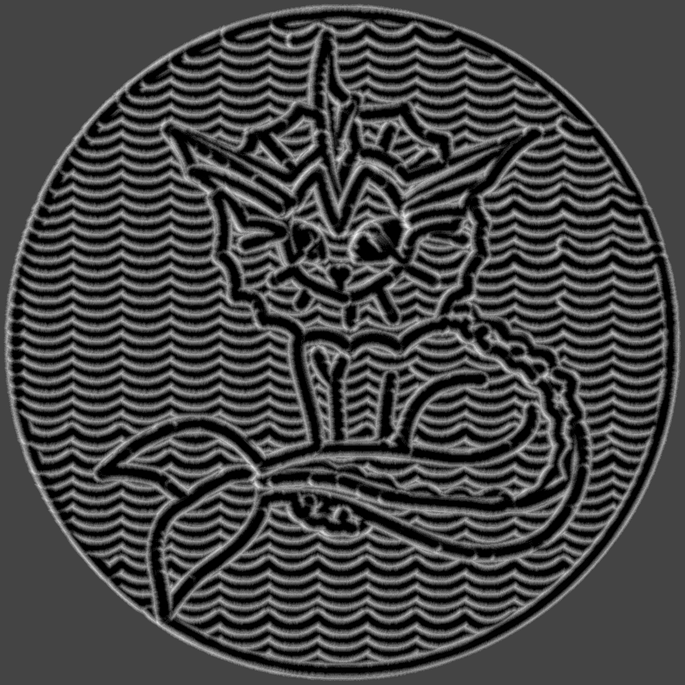

# ShowTHR

Read a THR file and simulate the motion of a ball rolling over a table covered in sand.

## Usage

```java -jar ShowTHR.jar <source.thr> <output> [-w <width>] [-h <height>] [-d <depth>] [-b <radius>]```

- `<source.thr>`: The path to the THR file.
- `<output>`: The path to the output file.  ImageIO supported formats are accepted, including pio and webp.
- `-w <width>`: The width of the output image.  Default is 300.
- `-h <height>`: The height of the output image.  Default is 300.
- `-b <radius>`: The radius of the ball.  Default is 5.
- `-d <depth>`: The starting depth of the sand.  Default is 2.

## Example



## Notes

The intensity of the output image is dictated by highest peak in the sand simulation.  The output image is normalized to the range [0, 255].
If one point of sand is very tall, the rest of the image will be very dark.

## License

Apache 2.0 License